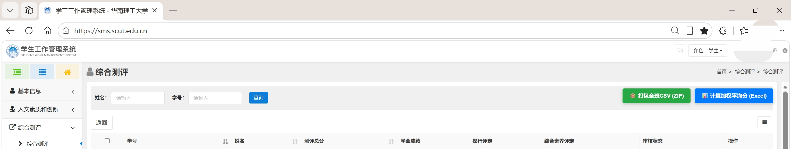

# SCUT-SMS-Toolkit

华南理工大学**综测数据工具箱** —— 基于油猴脚本的自动化导出与加权均分计算工具

**如果您觉得本项目有用，请给这个项目一个 Star**

### 免责声明

1. 如果你成功运行了该脚本，即代表你拥有本班的访问权限；
2. 本软件获得的内容都是班级内公开的数据，纯前端运行，不会越权读取学校系统数据，更不会向任何第三方上传数据；
3. 请尊重每一位通过自己努力合法提升成绩的同学，也请尊重成绩暂时落后的同学；
4. 综测即将结束时全班的加权成绩都会被公示出来，该软件只是提前做了这件事，晚知道不如早知道。

---

## 🚀 面向用户：一键安装

无需配置任何编译环境，只要浏览器装有油猴扩展，点击下方按钮即可一键安装：

[](https://raw.githubusercontent.com/Breeze1733/scut-sms-toolkit/main/scut-sms-toolkit.user.js)

[-FF5627?style=for-the-badge&logo=jsdelivr&logoColor=white)](https://cdn.jsdelivr.net/gh/Breeze1733/scut-sms-toolkit@main/scut-sms-toolkit.user.js)

> 💡 **提示**：如果点击 GitHub 官方源无法打开或加载缓慢，请直接点击 **【国内镜像一键安装】**（基于 jsDelivr CDN 加速）。

### 前置准备

如果你的电脑尚未安装脚本管理器扩展，推荐先安装以下任一浏览器扩展（已安装请忽略）：
* [Tampermonkey（篡改猴 - Chrome 商店）](https://chromewebstore.google.com/detail/tampermonkey/dhdgffkkebhmkfjojejmpbldmpobfkfo)
* [Tampermonkey（Edge 扩展中心）](https://microsoftedge.microsoft.com/addons/detail/tampermonkey/iikmkjmpaadaobahmlepeloendndfphd)
* 或 [Violentmonkey（暴力猴）](https://violentmonkey.github.io/) / [ScriptCat（脚本猫）](https://docs.scriptcat.org/)

安装好扩展后，点击上方 **【一键安装】** 链接，在弹出的窗口中点击 **“安装”** 或 **“更新”** 即可。

---

## 使用方法

建议配合 Google Chrome 或 Microsoft Edge 浏览器完成操作。

### 1. 登录官网

打开 [华南理工大学学生信息管理系统 (SMS)](https://sms.scut.edu.cn/)（校外访问可直接打开 [华工 WebVPN 入口](https://sms-443.webvpn.scut.edu.cn/)）

使用统一认证登录，等待网页加载完成。

### 2. 进入综测列表页

在左侧菜单进入“综合测评” - “公示信息”列表页，确保当前处于包含全班学生列表的表格界面（每行包含“查看”操作链接）。



### 3. 运行脚本功能

此时页面右上角会自动浮现两个操作按钮：

```text
[📦 打包全班CSV (ZIP)]    [📊 计算加权平均分 (Excel)]
```

#### 功能一：打包全班 CSV (ZIP)
* 点击 **【📦 打包全班CSV (ZIP)】** 按钮；
* 脚本将自动逐个获取全班同学的明细数据；
* 抓取完成后会自动生成带有 UTF-8 BOM 的 CSV 文件（Windows Excel 双击打开不乱码），并打包为 `.zip` 压缩文件自动下载。

#### 功能二：计算加权平均分 (Excel)
* 点击 **【📊 计算加权平均分 (Excel)】** 按钮；
* 按钮会实时显示抓取计算进度（例如 `⏳ 计算中 (1/32)：张三`）；
* 计算完成后自动生成 `.xlsx` 表格并触发下载。

---

## 数据说明（双 Sheet）

导出的 Excel 表格会自动生成两个独立的工作表（Sheet），方便直接对照核对：

| 工作表名称 (Sheet) | 包含课程类型 | 排除课程类型 | 表头格式 |
| :--- | :--- | :--- | :--- |
| **必修课＋选修课** | 包含“必修”或“选修”的课程（专业必修、公共必修、专业选修等） | 课程类型包含“通选”的通选课、任选课 | 姓名、加权平均分、学分总数 |
| **仅必修课** | 仅限包含“必修”的课程（专业必修、公共必修等） | 所有选修课、通选课及非必修课程 | 姓名、加权平均分、学分总数 |

* **成绩解析**：兼容纯数字成绩（如 `92.5`）与等级制分数（如 `优秀（95.0）`、`良好(85.0)`）；
* **计算公式**：

  $$
  \text{加权均分} = \frac{\sum (\text{课程成绩} \times \text{课程学分})}{\sum \text{课程学分}}
  $$

  即 `加权均分 = ∑(单科成绩 × 学分) ÷ ∑总学分`，计算结果四舍五入保留 2 位小数。

由于不同学院对于综测选修课门数、选修课学分上限或补修课程的抵扣规则可能略有差异

---

## 许可协议

本项目基于 [MIT License](LICENSE) 开源。


